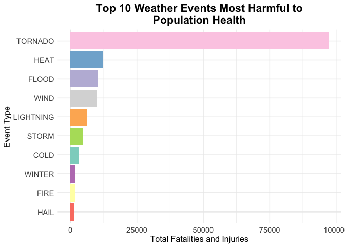
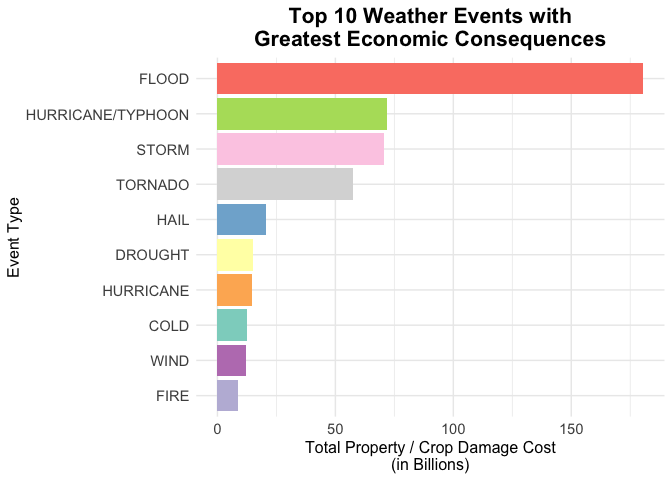

----

## Synopsis:  
This report analyzes the impacts of severe weather events on public health and the economy using NOAA's Storm Database. We load and clean the raw CSV data, then evaluate each event type based on fatalities and injuries to assess public health risks. We also calculate and rank economic losses by event type. Visualizations are used to highlight the most harmful weather types. The analysis is performed in R, using packages like `dplyr` for data manipulation and `ggplot2` for visualization. The goal is to help government managers understand the risks associated with different weather events and prioritize resources accordingly.

## Data Processing

### Load libraries

``` r
library(tidyverse)
```

### Download and load the data

The data for this assignment was downloaded from the course website. The events in the database start in the year 1950 and end in November 2011. 

- [Storm Data](https://d396qusza40orc.cloudfront.net/repdata%2Fdata%2FStormData.csv.bz2) [47Mb]

Here you will find how some of the variables are constructed/defined.

- National Weather Service [Storm Data Documentation](https://d396qusza40orc.cloudfront.net/repdata%2Fpeer2_doc%2Fpd01016005curr.pdf)

- National Climatic Data Center Storm Events [FAQ](https://d396qusza40orc.cloudfront.net/repdata%2Fpeer2_doc%2FNCDC%20Storm%20Events-FAQ%20Page.pdf)


``` r
url <- "https://d396qusza40orc.cloudfront.net/repdata%2Fdata%2FStormData.csv.bz2"
file_path <- "StormData.csv.bz2"
if (!file.exists(file_path)) {
  download.file(url, file_path, mode = "wb")
}
raw_data <- read.csv(file_path)
```

### Display dataset basic information

The original dataset imported for analysis consists of 902,297 observations and 37 variables.


``` r
raw_data <- as_tibble(raw_data)
raw_data
```

```
## # A tibble: 902,297 × 37
##    STATE__ BGN_DATE  BGN_TIME TIME_ZONE COUNTY COUNTYNAME STATE EVTYPE BGN_RANGE
##      <dbl> <chr>     <chr>    <chr>      <dbl> <chr>      <chr> <chr>      <dbl>
##  1       1 4/18/195… 0130     CST           97 MOBILE     AL    TORNA…         0
##  2       1 4/18/195… 0145     CST            3 BALDWIN    AL    TORNA…         0
##  3       1 2/20/195… 1600     CST           57 FAYETTE    AL    TORNA…         0
##  4       1 6/8/1951… 0900     CST           89 MADISON    AL    TORNA…         0
##  5       1 11/15/19… 1500     CST           43 CULLMAN    AL    TORNA…         0
##  6       1 11/15/19… 2000     CST           77 LAUDERDALE AL    TORNA…         0
##  7       1 11/16/19… 0100     CST            9 BLOUNT     AL    TORNA…         0
##  8       1 1/22/195… 0900     CST          123 TALLAPOOSA AL    TORNA…         0
##  9       1 2/13/195… 2000     CST          125 TUSCALOOSA AL    TORNA…         0
## 10       1 2/13/195… 2000     CST           57 FAYETTE    AL    TORNA…         0
## # ℹ 902,287 more rows
## # ℹ 28 more variables: BGN_AZI <chr>, BGN_LOCATI <chr>, END_DATE <chr>,
## #   END_TIME <chr>, COUNTY_END <dbl>, COUNTYENDN <lgl>, END_RANGE <dbl>,
## #   END_AZI <chr>, END_LOCATI <chr>, LENGTH <dbl>, WIDTH <dbl>, F <int>,
## #   MAG <dbl>, FATALITIES <dbl>, INJURIES <dbl>, PROPDMG <dbl>,
## #   PROPDMGEXP <chr>, CROPDMG <dbl>, CROPDMGEXP <chr>, WFO <chr>,
## #   STATEOFFIC <chr>, ZONENAMES <chr>, LATITUDE <dbl>, LONGITUDE <dbl>, …
```

### Dataset Reduction and Filtering

To streamline the analysis and improve computational efficiency, the dataset will be restricted to a subset of relevant variables, and observations with non-positive values (`value ≤ 0`) will be omitted.


``` r
select <- c("EVTYPE", "FATALITIES", "INJURIES", "PROPDMG", "PROPDMGEXP", 
            "CROPDMG", "CROPDMGEXP", "BGN_DATE", "END_DATE", "STATE")
tidy_data <- raw_data %>%
  filter(EVTYPE != "?",
         FATALITIES > 0 | INJURIES > 0 | PROPDMG > 0 | CROPDMG > 0) %>%
  select(all_of(select))
dim(tidy_data)
```

```
## [1] 254632     10
```

After processing, the dataset consists of 254,632 observations and 10 variables.

### Standardization of event types

The current tidy dataset contains a total of 487 unique event type values.


``` r
length(unique(tidy_data$EVTYPE))
```

```
## [1] 487
```

Examination of the Event Type variable uncovered multiple inconsistent representations
of the same underlying event type. These inconsistencies included variations in case, 
pluralization, and misspellings.

A normalization process was therefore applied, which involved converting all entries
to uppercase and merging similar event types into standardized categories.


``` r
# convert event type to upper
tidy_data$EVTYPE <- toupper(tidy_data$EVTYPE)
# Map regex patterns to target categories
pattern_mapping <- list(
  'AVALANCHE' = '.*AVALANCE.*',
  'BLIZZARD' = '.*BLIZZARD.*',
  'CLOUD' = '.*CLOUD.*',
  'COLD' = c('.*COLD.*', '.*FREEZ.*', '.*FROST.*', '.*ICE.*', 
             '.*LOW TEMPERATURE RECORD.*', '.*LO.*TEMP.*'),
  'DRY' = '.*DRY.*',
  'DUST' = '.*DUST.*',
  'FIRE' = '.*FIRE.*',
  'FLOOD' = '.*FLOOD.*',
  'FOG' = '.*FOG.*',
  'HAIL' = '.*HAIL.*',
  'HEAT' = c('.*HEAT.*', '.*WARM.*', '.*HIGH.*TEMP.*', '.*RECORD HIGH TEMPERATURES.*'),
  'HYPOTHERMIA/EXPOSURE' = '.*HYPOTHERMIA.*',
  'LANDSLIDE' = '.*LANDSLIDE.*',
  'LIGHTNING' = c('^LIGHTNING.*', '^LIGNTNING.*', '^LIGHTING.*'),
  'MICROBURST' = '.*MICROBURST.*',
  'MUDSLIDE' = c('.*MUDSLIDE.*', '.*MUD SLIDE.*'),
  'RAIN' = '.*RAIN.*',
  'RIP CURRENT' = '.*RIP CURRENT.*',
  'STORM' = '.*STORM.*',
  'SUMMARY' = '.*SUMMARY.*',
  'TORNADO' = c('.*TORNADO.*', '.*TORNDAO.*', '.*LANDSPOUT.*', '.*WATERSPOUT.*'),
  'SURF' = '.*SURF.*',
  'VOLCANIC' = '.*VOLCANIC.*',
  'WET' = '.*WET.*',
  'WIND' = '.*WIND.*',
  'WINTER' = c('.*WINTER.*', '.*WINTRY.*', '.*SNOW.*')
)
# Apply map
for (category in names(pattern_mapping)) {
  patterns <- pattern_mapping[[category]]
  for (pattern in patterns) {
    tidy_data$EVTYPE <- gsub(pattern, category, tidy_data$EVTYPE, ignore.case = TRUE)
  }
}
# Convert event type to a categorical (factor) variable
tidy_data$EVTYPE <- as.factor(tidy_data$EVTYPE)
```

After processing, the number of unique Event Type values were reduced to 81.


``` r
length(unique(tidy_data$EVTYPE))
```

```
## [1] 81
```

### Clean Economic Data

The PROPDMGEXP and CROPDMGEXP columns were cleaned and standardized to enable accurate
calculation of property and crop damage costs. As part of this process, two new 
variables — PROP_COST and CROP_COST — were created to store the respective monetary
estimates of damage.


``` r
# function to get multiplier factor
getMultiplier <- function(exp) {
    exp <- toupper(exp);
    if (exp == "")  return (10^0);
    if (exp == "-") return (10^0);
    if (exp == "?") return (10^0);
    if (exp == "+") return (10^0);
    if (exp == "0") return (10^0);
    if (exp == "1") return (10^1);
    if (exp == "2") return (10^2);
    if (exp == "3") return (10^3);
    if (exp == "4") return (10^4);
    if (exp == "5") return (10^5);
    if (exp == "6") return (10^6);
    if (exp == "7") return (10^7);
    if (exp == "8") return (10^8);
    if (exp == "9") return (10^9);
    if (exp == "H") return (10^2);
    if (exp == "K") return (10^3);
    if (exp == "M") return (10^6);
    if (exp == "B") return (10^9);
    return (NA);
}
# calculate property damage and crop damage costs (in billions)
tidy_data$PROP_COST <- with(tidy_data, as.numeric(PROPDMG) * sapply(PROPDMGEXP, getMultiplier))/10^9
tidy_data$CROP_COST <- with(tidy_data, as.numeric(CROPDMG) * sapply(CROPDMGEXP, getMultiplier))/10^9
```

### Summarize Data

Generate a summary dataset containing health impact data (including fatalities and injuries).  
Sort the results in descending order based on the magnitude of health impact.


``` r
health_data <- tidy_data %>%
  mutate(HEALTH_IMPACT = FATALITIES + INJURIES) %>%
  group_by(EVENT_TYPE = EVTYPE) %>%
  summarise(HEALTH_IMPACT = sum(HEALTH_IMPACT, na.rm = TRUE)) %>%
  arrange(desc(HEALTH_IMPACT))
```


Generate a summary dataset containing damage impact costs (including property damage and crop damage).  
Sort the results in descending order based on the total damage cost.


``` r
damage_data <- tidy_data %>%
  mutate(DAMAGE_IMPACT = PROP_COST + CROP_COST) %>%
  group_by(EVENT_TYPE = EVTYPE) %>%
  summarise(DAMAGE_IMPACT = sum(DAMAGE_IMPACT, na.rm = TRUE)) %>%
  arrange(desc(DAMAGE_IMPACT))
```

## Results

### Weather Events with the Greatest Impact on Public Health

To understand which weather events have the most significant impact on public health, we analyzed fatalities and injuries caused by various types of severe weather. Below are the top 10 most harmful weather events in terms of their effect on public health in the U.S.


``` r
head(health_data, 10)
```

```
## # A tibble: 10 × 2
##    EVENT_TYPE HEALTH_IMPACT
##    <fct>              <dbl>
##  1 TORNADO            97075
##  2 HEAT               12392
##  3 FLOOD              10127
##  4 WIND                9893
##  5 LIGHTNING           6049
##  6 STORM               4780
##  7 COLD                3100
##  8 WINTER              1924
##  9 FIRE                1698
## 10 HAIL                1512
```

The following plot visually represents these findings, highlighting the event types that lead to the highest number of combined fatalities and injuries.


``` r
health_data %>%
  head(10) %>%
  ggplot(aes(x = reorder(EVENT_TYPE, HEALTH_IMPACT), y = HEALTH_IMPACT, fill = EVENT_TYPE)) +
  geom_bar(stat = "identity", show.legend = FALSE) +
  coord_flip() +
  labs(
    title = "Top 10 Weather Events Most Harmful to\nPopulation Health",
    x = "Event Type",
    y = "Total Fatalities and Injuries"
  ) +
  theme_minimal() +
  theme(
    plot.title = element_text(size = 16, face = "bold", hjust = 0.5),
    axis.title = element_text(size = 12),
    axis.text.x = element_text(size = 11),
    axis.text.y = element_text(size = 11)
  ) +
  scale_fill_brewer(palette = "Set3")
```

<!-- -->

### Weather Events Causing the Highest Economic Losses

In examining the economic impacts of severe weather, property and crop damage were key indicators. The analysis below showcases the top 10 weather events leading to the greatest economic losses due to property and crop damage within the U.S.


``` r
head(damage_data)
```

```
## # A tibble: 6 × 2
##   EVENT_TYPE        DAMAGE_IMPACT
##   <fct>                     <dbl>
## 1 FLOOD                     181. 
## 2 HURRICANE/TYPHOON          71.9
## 3 STORM                      70.4
## 4 TORNADO                    57.4
## 5 HAIL                       20.7
## 6 DROUGHT                    15.0
```

This bar chart provides a visual summary of the weather events associated with the highest total costs from property and crop damages.


``` r
damage_data %>%
  head(10) %>%
  ggplot(aes(x = reorder(EVENT_TYPE, DAMAGE_IMPACT), y = DAMAGE_IMPACT, fill = EVENT_TYPE)) +
  geom_bar(stat = "identity", show.legend = FALSE) +
  coord_flip() +
  labs(
    title = "Top 10 Weather Events with\nGreatest Economic Consequences",
    x = "Event Type",
    y = "Total Property / Crop Damage Cost\n(in Billions)"
  ) +
  theme_minimal() +
  theme(
    plot.title = element_text(size = 16, face = "bold", hjust = 0.5),
    axis.title = element_text(size = 12),
    axis.text.x = element_text(size = 11),
    axis.text.y = element_text(size = 11)
  ) +
  scale_fill_brewer(palette = "Set3")
```

<!-- -->

### Conclusion

From this analysis, supported by the data and graphical representations provided, we can conclude:

- **Which weather events are most detrimental to public health?**
  
  Tornadoes cause the highest number of fatalities and injuries.
  
- **Which weather events result in the largest economic losses?**
  
  Floods lead to the greatest costs related to property and crop damage.
